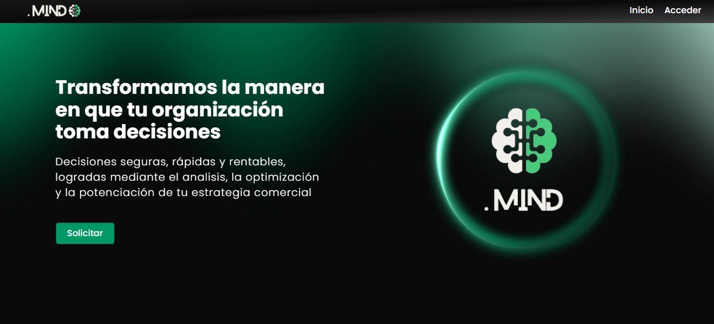

# 👋 Jorge Neder – Frontend / Fullstack Developer

💻 Apasionado por crear interfaces limpias y funcionales, con lógica sólida detrás.  
Frontend & Fullstack Developer passionate about building clean, functional interfaces with solid logic behind the scenes.

---

## 🔧 Tecnologías / Tech Stack

---

## 💼 Proyectos Destacados / Featured Projects

### Puntomind (proyecto privado / private project)  
  
**Stack:** Next.js, Typescript, Redux-Toolkit, TailwindCSS, Django (Django rest framework & Django ORM), Python, PostgreSQL, Redis, Docker, Nginx, Linux VPS (ubuntu server)  
Saas (Software as a service) destinado a mejorar la gestión empresarial y la estratégia comercial de las empresas, con informes, matrices, métodos, métricas, gráficos y analiticas profesionales.  
/ SaaS (Software as a Service) designed to improve business management and commercial strategy with professional reports, matrices, methods, metrics, graphs, and analytics.  
[🔗 Ver en produccion](https://puntomind.com/)  

### [Numa](https://github.com/JorgeNeder97/numa)
  
**Stack:** Next.js, TypeScript, Prisma, PostgreSQL  
Aplicación de finanzas personales con visualización de balances y registro de movimientos.  
/ Personal finance app with balance visualization and transaction tracking.  
[🔗 Ver demo](https://numa-kappa.vercel.app/)  

### [Just Coffee](https://github.com/JorgeNeder97/just-coffee)  
  
**Stack:** Next.js, React, TypeScript, TailwindCSS  
Web para amantes del café con diseño responsive y componentes reutilizables.  
/ Coffee lovers web app with responsive design and reusable components.  
[🔗 Ver demo](https://just-coffee-sage.vercel.app/)  

---

## 📫 Contacto / Contact

- [LinkedIn](https://www.linkedin.com/in/jorge-neder/)  
- [Email](mailto:jorge.neder97@gmail.com)  
- [GitHub](https://github.com/JorgeNeder97)

---

## 🎯 Objetivo Profesional / Career Goal

Busco oportunidades como **Frontend o Fullstack Developer**, donde pueda aportar mi pasión por el frontend, conocimientos de backend y capacidad de resolver problemas de manera eficiente.  
Looking for opportunities as a **Frontend or Fullstack Developer**, where I can contribute my passion for frontend, backend knowledge, and problem-solving skills.

---

## 📈 Estadísticas / GitHub Stats

<!--
**JorgeNeder97/JorgeNeder97** is a ✨ _special_ ✨ repository because its `README.md` (this file) appears on your GitHub profile.

Here are some ideas to get you started:

- 🔭 I’m currently working on ...
- 🌱 I’m currently learning ...
- 👯 I’m looking to collaborate on ...
- 🤔 I’m looking for help with ...
- 💬 Ask me about ...
- 📫 How to reach me: ...
- 😄 Pronouns: ...
- ⚡ Fun fact: ...
-->
